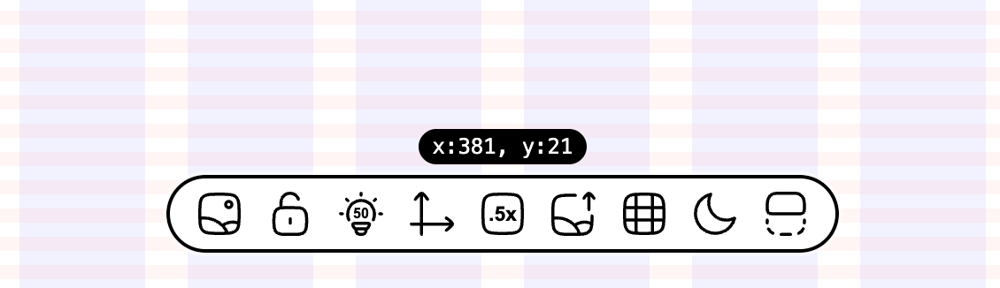

# Pixel Mirror



Overlay design mockups on web pages for pixel-perfect UI implementation. Features adjustable transparency, scaling, alignment, and grid guides.

## Features

- **Mockup overlay** with opacity, scale, alignment, drag positioning, and a 5-state mode system (visible / locked / dragging / solid / zoomed)
- **Grid overlay** with layout columns and spacing guides
- **Desktop**: keyboard shortcuts, Ctrl+Scroll opacity, click-to-zoom (2x), mouse pan
- **Mobile / Touch**: double-tap solid mode, pinch-to-zoom (0.25x–4x), touch drag & pan, slide-to-adjust opacity
- **Hybrid device support**: touch and keyboard/mouse inputs coexist seamlessly

## Overlay Modes

The mockup overlay has 5 modes:

| Mode         | Description                                                                   |
| ------------ | ----------------------------------------------------------------------------- |
| **Visible**  | Default. Drag, adjust opacity/scale/alignment.                                |
| **Locked**   | Position frozen, no interaction except unlock.                                |
| **Dragging** | Active during drag, returns to visible on release.                            |
| **Solid**    | 100% opacity for pixel comparison. Desktop: hold `Space`; Mobile: double-tap. |
| **Zoomed**   | 2x zoom with mouse pan (desktop only). Click in solid mode to enter.          |

## Usage

### Desktop

| Action                          | Shortcut                                |
| ------------------------------- | --------------------------------------- |
| Show / Hide mockup              | Toolbar button                          |
| Lock / Unlock position          | `Escape` or toolbar button              |
| Adjust opacity                  | `Ctrl + Scroll` (click button to reset) |
| Drag mockup                     | Mouse drag on overlay                   |
| Nudge mockup (1px)              | Arrow keys                              |
| Nudge mockup (10px)             | `Shift` + Arrow keys                    |
| Enter solid mode (100% opacity) | Hold `Space`                            |
| Zoom (2x) in solid mode         | Click                                   |
| Pan in zoomed mode              | Move mouse                              |
| Cycle scale (1x / 0.5x)         | Toolbar button                          |

### Mobile / Touch

| Action                   | Gesture                            |
| ------------------------ | ---------------------------------- |
| Show / Hide mockup       | Toolbar button                     |
| Lock / Unlock position   | Toolbar button                     |
| Adjust opacity           | Horizontal slide on opacity button |
| Drag mockup              | Touch drag on overlay              |
| Toggle solid mode        | Double-tap anywhere                |
| Pinch zoom in solid mode | Two-finger pinch (0.25x–4x)        |
| Pan in solid mode        | Single finger drag                 |
| Cycle scale (1x / 0.5x)  | Toolbar button                     |

## Installation

```bash
npm install pixel-mirror --save-dev
```

### Vite

```js
// vite.config.js
import pixelMirror from "pixel-mirror/vite";

export default defineConfig({
  plugins: [pixelMirror()]
});
```

### Astro

```js
// astro.config.mjs
import pixelMirror from "pixel-mirror/astro";

export default defineConfig({
  integrations: [pixelMirror()]
});
```

### Next.js

```jsx
// _document.jsx <Head>
{
  process.env.NODE_ENV === "development" && (
    <Script src="https://cdn.jsdelivr.net/npm/pixel-mirror/dist/index.js" strategy="afterInteractive" />
  );
}
```

### CDN

```html
<script defer src="https://cdn.jsdelivr.net/npm/pixel-mirror/dist/index.js"></script>
```

Remove in production.

## Note

This tool sets an inline `position: relative` style on the `<html>` element for overlay positioning. This may affect layouts that depend on the default `static` positioning of `<html>`.

On touch devices, browser pinch-to-zoom is temporarily disabled while the mockup overlay is visible to avoid conflicts with the tool's gesture handling. It reverts to normal when the overlay is hidden.

## Credits

Icons by https://hugeicons.com
